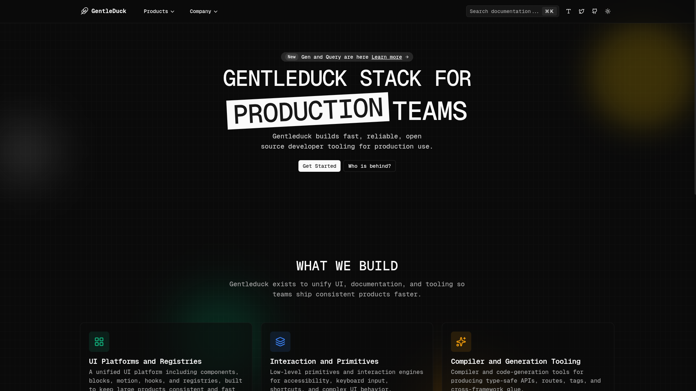

<p align="center">
  
</p>

# @gentleduck

GentleDuck is an open source organization building production-grade developer tooling. We exist to 
reduce friction across the entire development lifecycle, from UI and interaction design to 
documentation, automation, testing, and systems performance.
 
## Documentation
- Website: https://www.gentleduck.org
- GitHub: https://github.com/gentleeduck/duck-ui

## What's in the Repo
### Apps
- `apps/duck-ui-docs` – UI docs site (components, blocks, charts, themes)
- `apps/duck-gen-docs` – Duck Gen docs site

### Packages (Selected)
- `packages/duck-docs` – shared docs app kit used by the docs apps
- `packages/registry-ui-duckui` – UI components
- `packages/registry-blocks-duckui` – blocks and layouts
- `packages/registry-examples-duckui` – examples used in docs
- `packages/duck-libs` – utilities
- `packages/duck-hooks` – React hooks
- `packages/duck-motion` – motion primitives
- `packages/duck-variants` – class/variant helpers
- `packages/duck-vim` – keybinding engine
- `packages/duck-lazy` – lazy-loading utilities

### Published packages (npm)
- `@gentleduck/benchmark` – benchmarking tool for Duck UI components
- `@gentleduck/cli` – CLI to add components and bootstrap integrations
- `@gentleduck/gen` – type-safe API and message generator (NestJS-tested)
- `@gentleduck/hooks` – React hooks
- `@gentleduck/lazy` – lazy-loading utilities
- `@gentleduck/libs` – utilities and helpers
- `@gentleduck/motion` – motion primitives
- `@gentleduck/primitives` – headless UI primitives
- `@gentleduck/query` – type-safe Axios client
- `@gentleduck/shortcut` – keyboard shortcut utilities
- `@gentleduck/variants` – class/variant helpers
- `@gentleduck/vim` – keybinding engine

## Getting Started
```bash
git clone https://github.com/gentleeduck/duck-ui.git
cd duck-ui
pnpm install
```

## Run a Single App
```bash
pnpm --filter @gentleduck/ui-docs dev
pnpm --filter @gentleduck/gen-docs dev
```

## Contributing
We welcome contributions. Please read [`CONTRIBUTING.md`](./CONTRIBUTING.md) and [`CODE_OF_CONDUCT.md`](./CODE_OF_CONDUCT.md).

## License
MIT. See [`LICENSE`](./LICENSE) for more information.
