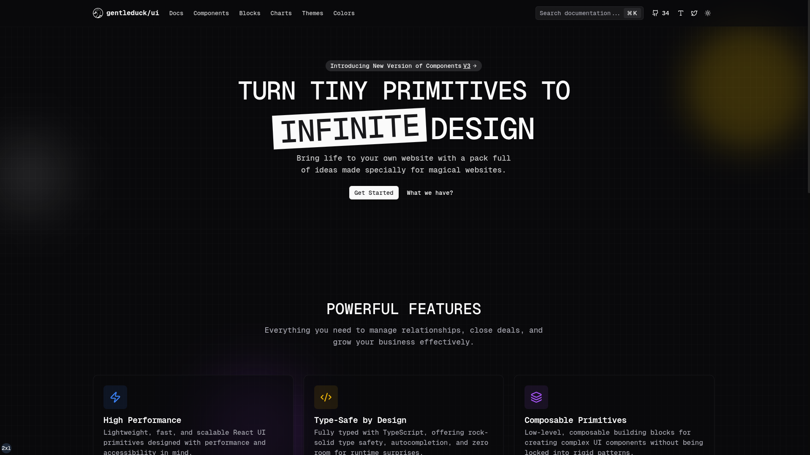

<p align="center">
  
</p>

# Gentleduck Ui

This repository is part of the [Gentleduck](https://ui.gentleduck.org) project — a collection of modern, flexible, and developer-friendly software components designed to solve real-world problems in computer science and web development.

Gentleduck goes beyond just UI components: this monorepo includes **packages and tools** that cover multiple aspects of building high-quality applications.

---

## Documentation

Comprehensive documentation, guides, and examples can be found here:

* Website: [ui.gentleduck.org](https://ui.gentleduck.org)
* GitHub Source: [github.com/gentleeduck/duck-ui](https://github.com/gentleeduck/duck-ui)

---

## Getting Started

Clone the repo:

```bash
git clone https://github.com/gentleeduck/duck-ui.git
cd duck-ui
```

Install dependencies (using [pnpm](https://pnpm.io) recommended):

```bash
pnpm install
```

Build all packages:

```bash
pnpm build
```

Run the local dev environment:

```bash
pnpm dev
```

---

## Contributing

We welcome contributions! Whether it’s fixing bugs, adding new features, or improving documentation — your help is appreciated.

1. Fork the repo
2. Create a feature branch
3. Commit changes
4. Open a Pull Request

Please read our [contributing guide](CONTRIBUTING.md) (coming soon) for details.

---

## License

This project is licensed under the **MIT License**.
See [LICENSE](LICENSE) for more information.

---

## Acknowledgments

Gentleduck is built with love to make development smoother, faster, and more enjoyable. 🦆💛
